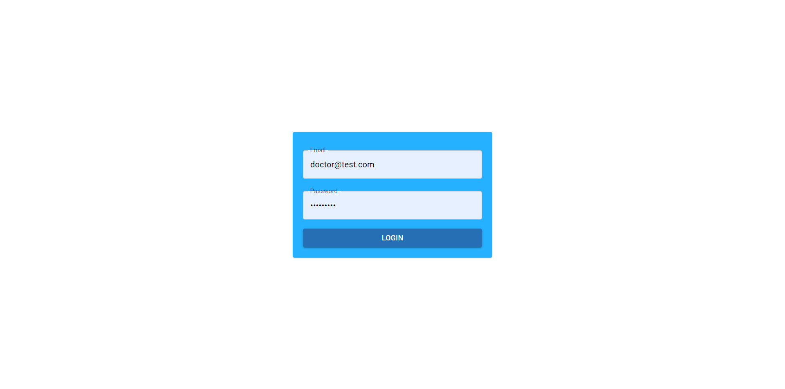
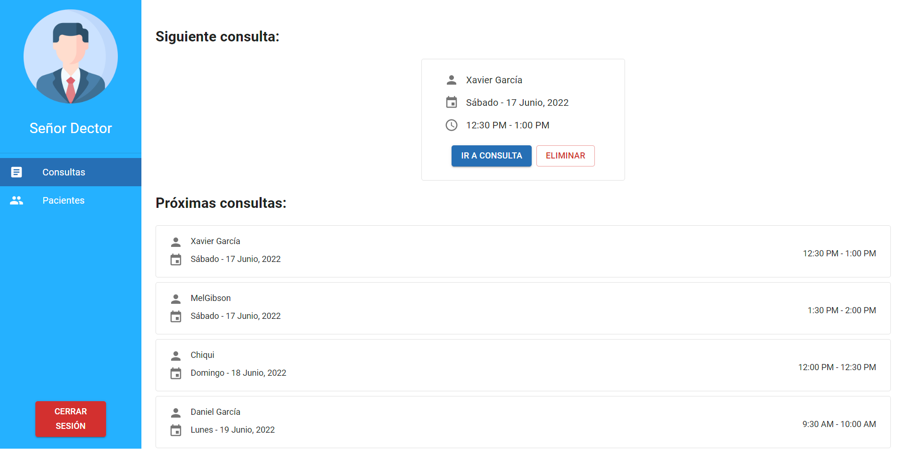
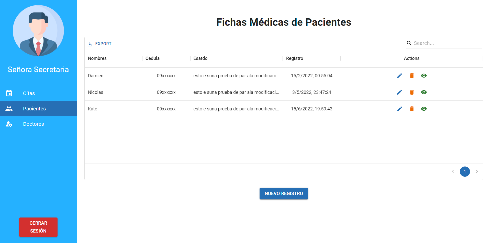

# Livet Web App

## Participants 🛠️:
  + Briones Chonillo Ana María
  + Recalde Bravo Allison Doménica
  + García Baño Xavier Patricio
  + Segura Merchan Ronny Hugo
  + Medina Burbano Erwing Manuel
  + Montenegro García Danny Josue

## General Information

Livet Project is a web application meant to schedule medical consults and handle medical records.

This repository corresponds ONLY to the frontend solution.

## Technologies Used
  + HTML
  + CSS
  + JavaScript
  + ReactJS
  + NodeJS
  + Redux
  + Material UI
  + AWS Amplify

## Features ⚙️
Log in


HOME Doctor


HOME Secretary


## Setup 🚀
### Steps
clone repository
 ```
~$ ./git clone https://github.com/XPGarcia/T07_livet_web_app.git
```

install dependencies
 ```
~$ ./npm i
```

run the project
```
~$ ./npm start
```

## Main Users
  + Doctor
  + Nurse/Secretary
  
  
## Directory structure
```
root
│   .eslintrc.json
│   .gitignore
│   .prettierrc
│   package-lock.json
│   package.json
│   README.md
│
└───src
│   │   App.js
│   │   index.js
│   │   index.css
│   └───Assets      # Static resources as images
│   └───Components  # Logical Small Components
│   └───Config      # System config
│   └───Layouts     # Predesigned layouts
│   └───Pages       # Rendered pages of the application
│   └───Routes      # Routes and routing
│   └───Services    # Connection with outside services as API
│   └───Store       # Redux store for the states
│   └───UI          # Components related with the interface
```

## Libraries
- "@devexpress/dx-react-scheduler": "^3.0.3"
- "@devexpress/dx-react-scheduler-material-ui": "^3.0.3"
- "@mui/material": "^5.8.3"
- "@mui/x-data-grid": "^5.12.1"
- "@reduxjs/toolkit": "^1.8.2",
- "@testing-library/jest-dom": "^5.16.4"
- "@testing-library/react": "^13.2.0"
- "amazon-cognito-identity-js": "^5.2.9"
- "babel-eslint": "^10.1.0"
- "date-fns": "^2.28.0"
- "jwt-decode": "^3.1.2"
- "prettier": "^2.7.1"
- "react": "^18.1.0"
- "react-dom": "^18.1.0"
- "react-redux": "^8.0.2"
- "react-router-dom": "^6.3.0"
- "redux-react-session": "^2.6.1"
- "styled-components": "^5.3.5"
  
